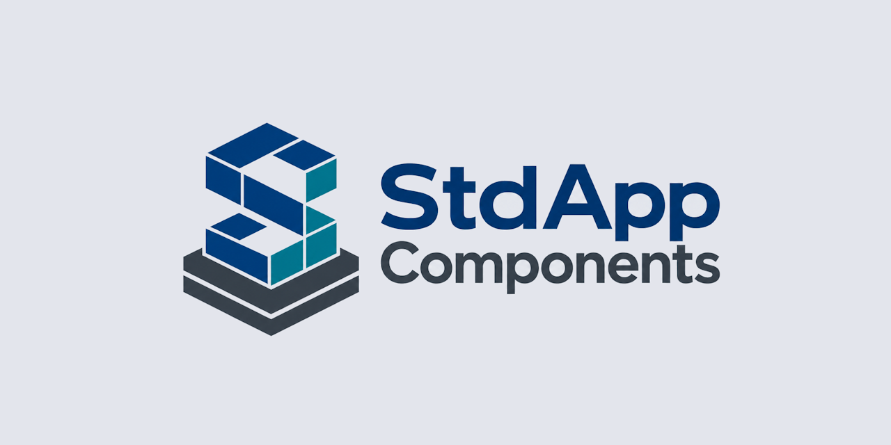

<div align="center">



<br>

[](https://discord.gg/Wb6z8Wam7p) [](https://bsky.app/profile/tinybiggames.com) 

</div>

## What is StdApp?

**StdApp** is a modular Delphi component library for Win64 applications. It provides foundational services that your projects can build on: error handling, console I/O, JSON, virtual memory, file archives, in-memory DLL loading, C header importing, runtime C compilation, resource compilation, and testing.

Units are designed to be mixed and matched. Most depend only on WinApi and System. Several -- VMM, DllLoader, IATHook, Console, JSON -- have zero StdApp dependencies and can be dropped into any project standalone.

## Features

- :package: **In-Memory DLL Loading** -- Load Win64 DLLs from memory buffers or embedded RT_RCDATA resources. Batch-load interdependent DLLs with automatic dependency resolution via depth-first topological sorting. Uses NT loader hooking for Windows 10/11 compatibility including 24H2.

- :wrench: **C Header to Delphi Converter** -- Preprocess C headers via embedded libtcc, parse structs/enums/unions/typedefs/function pointers, and generate complete Delphi import units. Five binding modes: static (embedded RCDATA), dynamic, delayed, custom handle, and VPK archive loading. JSON configuration.

- :file_folder: **VPK Virtual File System** -- Pack directory trees into a single VPK archive. Read files via memory-mapped I/O with O(1) path lookup. Built on TVirtualMemory -- packing uses sparse-file-backed buffers, reading uses read-only file mapping.

- :zap: **Virtual Memory** -- Generic memory-mapped buffers with sparse temp file backing. Anonymous allocations consume disk only for pages written -- allocate 60GB+ with no commit charge. File-backed read-only, read-write, and copy-on-write modes. Typed views and runtime growth.

- :computer: **Console I/O** -- ANSI-colored terminal output, cursor control, progress bars, spinners, horizontal rules, and raw key input. Interactive menu system with nested submenus, multi-column layout, and automatic test/demo integration.

- :page_facing_up: **JSON** -- Fluent builder, reader, and writer. Dot-path navigation, array iteration, chained object construction, file/string/stream loading. View-based design over System.JSON.

- :hammer: **Resource Compiler** -- Create standard Windows .res files programmatically. Embed DLLs, icons, manifests, version info, and binary data without rc.exe or brcc32.

- :gear: **Runtime C Compilation** -- Embedded libtcc wrapper. The compiler DLL loads from an embedded resource via StdApp.DllLoader. TCC's include and lib files are served from an embedded ZIP via IAT hooking (StdApp.ZipVFS). Ships as a single executable.

- 🧪 **Test Framework** -- Section/check pattern for unit tests (TTestCase) and a demo runner with game-loop lifecycle and delta-time tracking (TTestDemo). Supports single-frame and looping demos. Integrates with the console menu system.

- :rocket: **Memory Manager** -- Zero-dependency bump allocator. Reserves 64 GB address space via SEC_RESERVE, commits 1 MB pages on demand. 26 size classes (16B--64KB) with O(1) freelist alloc/free. Oversized block reuse. No uses clause -- all WinAPI declared directly to avoid finalization-order issues.

- :link: **IAT Hooking** -- Intercept Windows API calls from loaded DLLs by patching Import Address Tables. Used internally by StdApp.ZipVFS to redirect file I/O to embedded archives.

See [docs/StdApp.md](docs/StdApp.md) for detailed unit documentation, API reference, dependency graphs, and integration guidance.

## Getting Started

1. Clone the repository:

```bash
git clone https://github.com/tinyBigGAMES/StdApp.git
```

2. Add the `src` folder to your Delphi project search path
3. Add `StdApp.VMM` as the **first unit** in your .dpr uses clause (installs the memory manager)
4. Add whichever units you need:

```delphi
uses
  StdApp.VMM,           // MUST be first -- installs memory manager
  StdApp.Base,           // TBaseObject, TErrors
  StdApp.Console,        // ANSI console I/O
  StdApp.JSON,           // JSON reader/writer
  StdApp.VirtualMemory,  // Memory-mapped buffers
  StdApp.VFS;            // VPK virtual file system
```

## System Requirements

| | Requirement |
|---|---|
| **Host OS** | Windows 10/11 x64 |
| **Building from source** | Delphi 12.x or higher |

## Building from Source

1. Clone the repository
2. Open the project group in Delphi 12 or higher
3. Build and run **ImportLibs** first -- it generates the raylib import units and resources into `imports/`
4. Build **Testbed** -- it depends on the import units generated in step 3

## Project Structure

```
repo/
  src/                          Delphi source units
    StdApp.Base.pas               Error system, TBaseObject
    StdApp.CImporter.pas          C header to Delphi converter
    StdApp.Console.pas            ANSI console I/O
    StdApp.Console.Menu.pas       Interactive test/demo menu
    StdApp.Defines.inc            Compiler directives, Win64 guard
    StdApp.DllLoader.pas          In-memory PE/DLL loader
    StdApp.IATHook.pas            Import address table hooking
    StdApp.JSON.pas               JSON reader/writer/builder
    StdApp.LibTCC.pas             Embedded libtcc wrapper
    StdApp.ResCompiler.pas        Programmatic .res compiler
    StdApp.Resources.pas          Shared resource strings
    StdApp.TestCase.pas           Section/check test framework
    StdApp.TestDemo.pas           Demo runner with timing
    StdApp.Utils.pas              General-purpose utilities
    StdApp.VFS.pas                VPK virtual file system
    StdApp.VirtualMemory.pas      Sparse-file-backed memory mapping
    StdApp.VMM.pas                Zero-dependency memory manager
    StdApp.ZipVFS.pas             ZIP-from-resource file system
  projects/
    ImportLibs/                   Generates raylib import units (run first)
    testbed/                      Interactive test and demo runner
  imports/                        Generated import units (output of ImportLibs)
  libs/
    raylib/                       Raylib headers and DLL
  docs/
    StdApp.md                     Detailed unit documentation
  media/                          Logo and images
```

## Contributing

StdApp is an open project. Whether you are fixing a bug, improving documentation, or proposing a feature, contributions are welcome.

- **Report bugs**: Open an issue with a minimal reproduction. The smaller the example, the faster the fix.
- **Suggest features**: Describe the use case first. Features that emerge from real problems get traction fastest.
- **Submit pull requests**: Bug fixes, documentation improvements, and well-scoped features are all welcome. Keep changes focused.

Join the [Discord](https://discord.gg/Wb6z8Wam7p) to discuss development, ask questions, and share what you are building.

## Support the Project

StdApp is built in the open. If it saves you time or sparks something useful:

- :star: **Star the repo**: it costs nothing and helps others find the project
- :speech_balloon: **Spread the word**: write a post, mention it in a community you are part of
- :busts_in_silhouette: **[Join us on Discord](https://discord.gg/Wb6z8Wam7p)**: share what you are building and help shape what comes next
- :sparkling_heart: **[Become a sponsor](https://github.com/sponsors/tinyBigGAMES)**: sponsorship directly funds development and documentation
- :butterfly: **[Follow on Bluesky](https://bsky.app/profile/tinybiggames.com)**: stay in the loop on releases and development

## License

StdApp is licensed under the **Apache License 2.0**. See [LICENSE](https://github.com/tinyBigGAMES/StdApp/tree/main?tab=License-1-ov-file#readme) for details.

Apache 2.0 is a permissive open source license that lets you use, modify, and distribute StdApp freely in both open source and commercial projects. You are not required to release your own source code. The license includes an explicit patent grant. Attribution is required; keep the copyright notice and license file in place.

## Links

- [Discord](https://discord.gg/Wb6z8Wam7p)
- [Bluesky](https://bsky.app/profile/tinybiggames.com)
- [tinyBigGAMES](https://tinybiggames.com)

<div align="center">

**StdApp&#8482;** - Foundation component library for Delphi Win64

Copyright &copy; 2026-present tinyBigGAMES&#8482; LLC<br/>All Rights Reserved.

</div>
